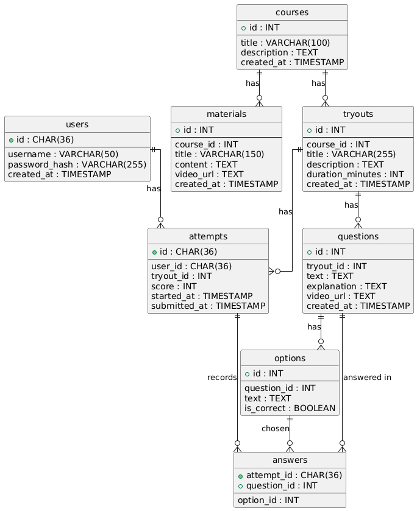

# 🧠 Tryout & Bimbel Online Backend

Dokumentasi ini menjelaskan struktur **database MySQL** untuk sistem **bimbel online sederhana** yang memiliki fitur:
- Autentikasi user
- Kursus (course)
- Materi pembelajaran
- Tryout (ujian)
- Soal, opsi jawaban, attempt, dan jawaban user

Database ini dirancang agar **mudah dikembangkan** ke fitur lanjutan seperti video pembahasan, role admin, dan analytics.

---

## 🗄️ Database

```sql
CREATE DATABASE tryout;
USE tryout;
```

Engine: **InnoDB** (mendukung foreign key & transaksi)

---

## 👤 Tabel: `users`
Menyimpan data pengguna aplikasi.

```sql
CREATE TABLE users (
  id CHAR(36) PRIMARY KEY,
  username VARCHAR(50) UNIQUE NOT NULL,
  password_hash VARCHAR(255) NOT NULL,
  created_at TIMESTAMP DEFAULT CURRENT_TIMESTAMP
) ENGINE=InnoDB;
```

**Keterangan kolom:**
- `id` → UUID user
- `username` → username login
- `password_hash` → password yang sudah di-hash (bcrypt)
- `created_at` → waktu registrasi

---

## 📚 Tabel: `courses`
Mewakili kursus/bimbel utama (contoh: UTBK, SMA Kelas 12 IPA).

```sql
CREATE TABLE courses (
  id INT AUTO_INCREMENT PRIMARY KEY,
  title VARCHAR(100) NOT NULL,
  description TEXT,
  created_at TIMESTAMP DEFAULT CURRENT_TIMESTAMP
);
```

Relasi:
- 1 course → banyak `materials`
- 1 course → banyak `tryouts`

---

## 📘 Tabel: `materials`
Materi pembelajaran dalam suatu course.

```sql
CREATE TABLE materials (
  id INT AUTO_INCREMENT PRIMARY KEY,
  course_id INT NOT NULL,
  title VARCHAR(150) NOT NULL,
  content TEXT,
  video_url TEXT,
  created_at TIMESTAMP DEFAULT CURRENT_TIMESTAMP,

  CONSTRAINT fk_material_course
    FOREIGN KEY (course_id)
    REFERENCES courses(id)
    ON DELETE CASCADE
);
```

**Catatan:**
- `video_url` biasanya berupa link YouTube (embedded di frontend)

---

## 📝 Tabel: `tryouts`
Paket ujian/tryout dalam suatu course.

```sql
CREATE TABLE tryouts (
  id INT AUTO_INCREMENT PRIMARY KEY,
  course_id INT NOT NULL,
  title VARCHAR(255) NOT NULL,
  description TEXT,
  duration_minutes INT,
  created_at TIMESTAMP DEFAULT CURRENT_TIMESTAMP,

  CONSTRAINT fk_tryout_course
    FOREIGN KEY (course_id)
    REFERENCES courses(id)
    ON DELETE CASCADE
);
```

Relasi:
- 1 course → banyak tryout
- 1 tryout → banyak soal

---

## ❓ Tabel: `questions`
Soal-soal dalam sebuah tryout.

```sql
CREATE TABLE questions (
  id INT AUTO_INCREMENT PRIMARY KEY,
  tryout_id INT NOT NULL,
  text TEXT NOT NULL,
  explanation TEXT,
  video_url TEXT,
  created_at TIMESTAMP DEFAULT CURRENT_TIMESTAMP,

  CONSTRAINT fk_question_tryout
    FOREIGN KEY (tryout_id)
    REFERENCES tryouts(id)
    ON DELETE CASCADE
) ENGINE=InnoDB;
```

**Catatan:**
- `explanation` → pembahasan teks
- `video_url` → video pembahasan (YouTube)

---

## 🔘 Tabel: `options`
Pilihan jawaban dari setiap soal.

```sql
CREATE TABLE options (
  id INT AUTO_INCREMENT PRIMARY KEY,
  question_id INT NOT NULL,
  text TEXT NOT NULL,
  is_correct BOOLEAN DEFAULT FALSE,

  FOREIGN KEY (question_id)
    REFERENCES questions(id)
    ON DELETE CASCADE
) ENGINE=InnoDB;
```

Relasi:
- 1 soal → banyak opsi
- hanya **1 opsi** bernilai `is_correct = true`

---

## 🧪 Tabel: `attempts`
Menyimpan data pengerjaan tryout oleh user.

```sql
CREATE TABLE attempts (
  id CHAR(36) PRIMARY KEY,
  user_id CHAR(36) NOT NULL,
  tryout_id INT NOT NULL,
  score INT,
  started_at TIMESTAMP DEFAULT CURRENT_TIMESTAMP,
  submitted_at TIMESTAMP,

  FOREIGN KEY (user_id)
    REFERENCES users(id),
  FOREIGN KEY (tryout_id)
    REFERENCES tryouts(id)
    ON DELETE CASCADE
) ENGINE=InnoDB;
```

---

## ✍️ Tabel: `answers`
Jawaban user untuk setiap soal dalam attempt.

```sql
CREATE TABLE answers (
  attempt_id CHAR(36) NOT NULL,
  question_id INT NOT NULL,
  option_id INT NOT NULL,
  PRIMARY KEY (attempt_id, question_id),

  FOREIGN KEY (attempt_id)
    REFERENCES attempts(id)
    ON DELETE CASCADE,
  FOREIGN KEY (question_id)
    REFERENCES questions(id),
  FOREIGN KEY (option_id)
    REFERENCES options(id)
) ENGINE=InnoDB;
```

---

## ⚡ Index
Untuk optimasi query:

```sql
CREATE INDEX idx_attempts_user ON attempts(user_id);
CREATE INDEX idx_options_question ON options(question_id);
CREATE INDEX idx_answers_attempt ON answers(attempt_id);
```

---

## 🔗 Entity Relationship Diagram



---

## 🚀 Catatan Pengembangan Lanjutan

Struktur ini mendukung pengembangan berikutnya:
- Role admin / user
- Video pembahasan per soal
- Progress belajar
- Subscription course
- Statistik & analytics tryout

---

📌 **Status:** Database final & siap dipakai backend Express + MySQL

